# DeezChat Architecture

## Overview

This document describes the architecture of the refactored DeezChat application, focusing on modularity, performance, and maintainability.

## High-Level Architecture

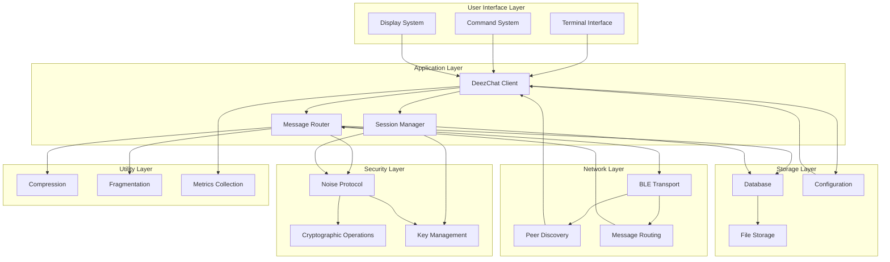

## Component Details

### 1. User Interface Layer

#### Terminal Interface (`ui/terminal.py`)
**Responsibilities**:
- Handle user input and display
- Manage terminal state and formatting
- Coordinate with command system

**Key Classes**:
```python
class TerminalInterface:
    """Main terminal interface"""
    def __init__(self, config: UIConfig):
        self.config = config
        self.command_system = CommandSystem()
        self.display_system = DisplaySystem(config.theme)
        
    async def start(self):
        """Start terminal interface"""
        
    async def handle_input(self):
        """Handle user input asynchronously"""
        
    def display_message(self, message: Message, context: DisplayContext):
        """Display message with formatting"""
```

#### Command System (`ui/commands.py`)
**Responsibilities**:
- Parse and execute user commands
- Provide command completion and help
- Manage command history

**Key Classes**:
```python
class CommandSystem:
    """Command processing system"""
    def __init__(self):
        self.commands = {}
        self.aliases = {}
        self.history = CommandHistory()
        
    def register_command(self, name: str, handler: CommandHandler):
        """Register a new command"""
        
    async def execute_command(self, input_line: str) -> CommandResult:
        """Execute command with error handling"""
        
    def get_completions(self, partial: str) -> List[str]:
        """Get command completions"""
```

#### Display System (`ui/display.py`)
**Responsibilities**:
- Format messages for display
- Manage color themes and styling
- Handle status indicators

**Key Classes**:
```python
class DisplaySystem:
    """Message formatting and display"""
    def __init__(self, theme: Theme):
        self.theme = theme
        self.formatters = {}
        
    def format_message(self, message: Message, context: DisplayContext) -> str:
        """Format message with theme"""
        
    def show_status(self, status: StatusInfo):
        """Display status information"""
        
    def apply_theme(self, text: str, style: TextStyle) -> str:
        """Apply theme styling to text"""
```

### 2. Application Layer

#### DeezChat Client (`core/client.py`)
**Responsibilities**:
- Orchestrate all components
- Manage application lifecycle
- Handle configuration and initialization

**Key Classes**:
```python
class DeezChatClient:
    """Main application client"""
    def __init__(self, config: Config):
        self.config = config
        self.running = False
        
        # Initialize components
        self.ui = TerminalInterface(config.ui)
        self.network = BLENetworkLayer(config.network)
        self.security = NoiseSecurityLayer(config.security)
        self.storage = DatabaseLayer(config.storage)
        self.metrics = MetricsCollector()
        
    async def start(self):
        """Start the application"""
        
    async def stop(self):
        """Stop the application gracefully"""
        
    async def handle_message(self, message: Message) -> bool:
        """Handle incoming message"""
```

#### Message Router (`core/message.py`)
**Responsibilities**:
- Route messages to appropriate handlers
- Manage message prioritization and filtering
- Handle message transformation

**Key Classes**:
```python
class MessageRouter:
    """Message routing and processing"""
    def __init__(self):
        self.handlers = {}
        self.priority_queue = asyncio.PriorityQueue()
        self.duplicate_filter = BloomFilter()
        
    def register_handler(self, msg_type: MessageType, handler: MessageHandler):
        """Register message handler"""
        
    async def route_message(self, message: Message) -> bool:
        """Route message to appropriate handler"""
        
    def is_duplicate(self, message_id: str) -> bool:
        """Check for duplicate messages"""
```

#### Session Manager (`core/session.py`)
**Responsibilities**:
- Manage peer sessions and connections
- Handle session lifecycle and cleanup
- Coordinate with security layer

**Key Classes**:
```python
class SessionManager:
    """Manages peer sessions"""
    def __init__(self, max_sessions: int = 100):
        self.max_sessions = max_sessions
        self.active_sessions = {}
        self.session_pool = SessionPool()
        
    async def get_session(self, peer_id: str) -> Optional[Session]:
        """Get or create session with peer"""
        
    async def establish_session(self, peer_id: str) -> bool:
        """Establish new session with peer"""
        
    async def cleanup_sessions(self, max_age: timedelta):
        """Clean up old sessions"""
```

### 3. Security Layer

#### Noise Protocol (`security/noise.py`)
**Responsibilities**:
- Implement Noise Protocol framework
- Handle cryptographic operations
- Manage key exchange and session establishment

**Key Classes**:
```python
class NoiseProtocol:
    """Noise Protocol implementation"""
    def __init__(self, config: SecurityConfig):
        self.config = config
        self.handshake_state = {}
        self.sessions = {}
        
    async def perform_handshake(self, peer_id: str) -> Optional[Session]:
        """Perform Noise handshake with peer"""
        
    def encrypt_message(self, session: Session, plaintext: bytes) -> bytes:
        """Encrypt message using session"""
        
    def decrypt_message(self, session: Session, ciphertext: bytes) -> bytes:
        """Decrypt message using session"""
```

#### Key Management (`security/crypto.py`)
**Responsibilities**:
- Manage cryptographic keys
- Handle key rotation and storage
- Provide cryptographic utilities

**Key Classes**:
```python
class KeyManager:
    """Cryptographic key management"""
    def __init__(self, config: SecurityConfig):
        self.config = config
        self.identity_key = self.load_or_create_identity()
        self.key_rotation_timer = None
        
    def get_identity_key(self) -> PrivateKey:
        """Get identity private key"""
        
    def derive_session_keys(self, peer_public: bytes) -> Tuple[bytes, bytes]:
        """Derive session keys from peer public key"""
        
    async def rotate_keys(self):
        """Rotate keys periodically"""
```

### 4. Network Layer

#### BLE Transport (`network/ble.py`)
**Responsibilities**:
- Handle Bluetooth Low Energy communication
- Manage device discovery and connections
- Provide reliable message transport

**Key Classes**:
```python
class BLETransport:
    """BLE transport layer"""
    def __init__(self, config: NetworkConfig):
        self.config = config
        self.connection_pool = BLEConnectionPool()
        self.scanner = BLEScanner()
        
    async def start_scanning(self):
        """Start scanning for devices"""
        
    async def connect_to_device(self, device: BLEDevice) -> BLEConnection:
        """Connect to BLE device"""
        
    async def send_message(self, peer_id: str, message: bytes) -> bool:
        """Send message to peer"""
```

#### Peer Discovery (`network/discovery.py`)
**Responsibilities**:
- Discover nearby BitChat devices
- Manage device information and caching
- Handle device appearance/disappearance

**Key Classes**:
```python
class PeerDiscovery:
    """Peer discovery service"""
    def __init__(self, config: NetworkConfig):
        self.config = config
        self.discovered_peers = {}
        self.discovery_callbacks = []
        
    async def start_discovery(self):
        """Start peer discovery"""
        
    def register_callback(self, callback: DiscoveryCallback):
        """Register discovery event callback"""
        
    async def get_peers(self) -> List[PeerInfo]:
        """Get list of discovered peers"""
```

### 5. Storage Layer

#### Database (`storage/database.py`)
**Responsibilities**:
- Store and retrieve messages
- Manage conversation history
- Provide search and filtering

**Key Classes**:
```python
class DatabaseLayer:
    """Database abstraction layer"""
    def __init__(self, config: StorageConfig):
        self.config = config
        self.connection_pool = ConnectionPool()
        
    async def store_message(self, message: Message) -> bool:
        """Store message in database"""
        
    async def get_messages(self, filters: MessageFilters) -> List[Message]:
        """Get messages with filters"""
        
    async def search_messages(self, query: str) -> List[Message]:
        """Search messages"""
```

#### Configuration (`storage/config.py`)
**Responsibilities**:
- Manage application configuration
- Handle configuration persistence
- Provide configuration validation

**Key Classes**:
```python
class ConfigManager:
    """Configuration management"""
    def __init__(self, config_path: Optional[str] = None):
        self.config_path = config_path or self.get_default_path()
        self.config = self.load_config()
        self.watchers = {}
        
    def get(self, key: str, default: Any = None) -> Any:
        """Get configuration value"""
        
    def set(self, key: str, value: Any) -> bool:
        """Set configuration value"""
        
    def watch(self, key: str, callback: ConfigChangeCallback):
        """Watch for configuration changes"""
```

### 6. Utility Layer

#### Compression (`utils/compression.py`)
**Responsibilities**:
- Compress and decompress messages
- Handle compression algorithm selection
- Optimize compression ratios

#### Fragmentation (`utils/fragmentation.py`)
**Responsibilities**:
- Fragment large messages
- Reassemble message fragments
- Handle fragment ordering and validation

#### Metrics (`utils/metrics.py`)
**Responsibilities**:
- Collect performance metrics
- Provide monitoring and alerting
- Export metrics for analysis

## Data Flow

### Message Sending Flow

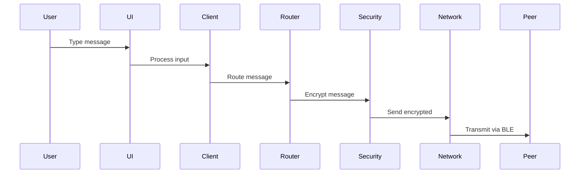

### Message Receiving Flow

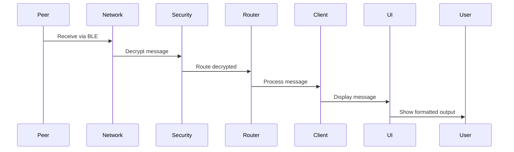

## Configuration Architecture

### Configuration Hierarchy

```mermaid
graph TD
    DEFAULT[Default Values] --> FILE[Config File]
    FILE --> ENV[Environment Variables]
    ENV --> CLI[Command Line Args]
    CLI --> RUNTIME[Runtime Config]
    
    subgraph "Config File Locations"
        LOCAL[./deezchat.yaml]
        USER[~/.config/deezchat/config.yaml]
        SYSTEM[/etc/deezchat/config.yaml]
    end
    
    FILE --> LOCAL
    FILE --> USER
    FILE --> SYSTEM
```

### Configuration Schema

```yaml
# Network Configuration
network:
  scan_interval: 5          # Seconds between scans
  max_peers: 50           # Maximum concurrent peers
  ttl: 7                  # Message time-to-live
  connection_timeout: 10     # Connection timeout in seconds
  retry_attempts: 3         # Connection retry attempts

# Security Configuration
security:
  encryption_algorithm: "ChaCha20-Poly1305"
  key_rotation_interval: 3600  # Seconds
  handshake_timeout: 5       # Handshake timeout in seconds
  session_timeout: 7200      # Session timeout in seconds

# UI Configuration
ui:
  theme: "default"         # Color theme
  timestamp_format: "%H:%M"
  show_fingerprints: false
  max_history_lines: 1000
  auto_scroll: true

# Storage Configuration
storage:
  data_dir: "~/.local/share/deezchat"
  max_history: 10000       # Messages to keep
  compress_history: true
  database_type: "sqlite"
  backup_enabled: true

# Logging Configuration
logging:
  level: "INFO"           # DEBUG, INFO, WARNING, ERROR
  file: "~/.local/share/deezchat/logs/deezchat.log"
  max_size: "10MB"
  backup_count: 5
  console_output: true
```

## Security Architecture

### Cryptographic Stack

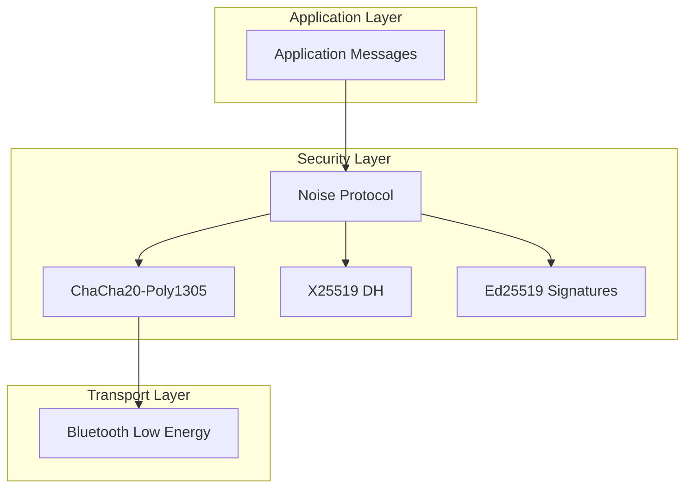

### Session Establishment

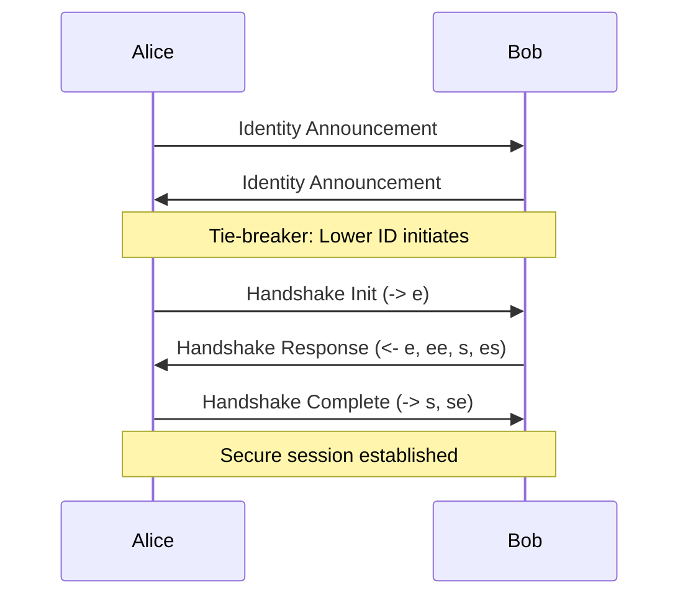

## Performance Architecture

### Memory Management

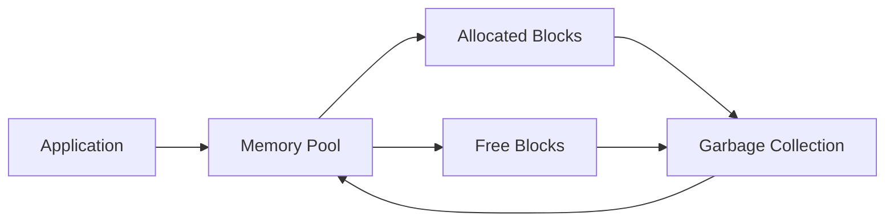

### Connection Management

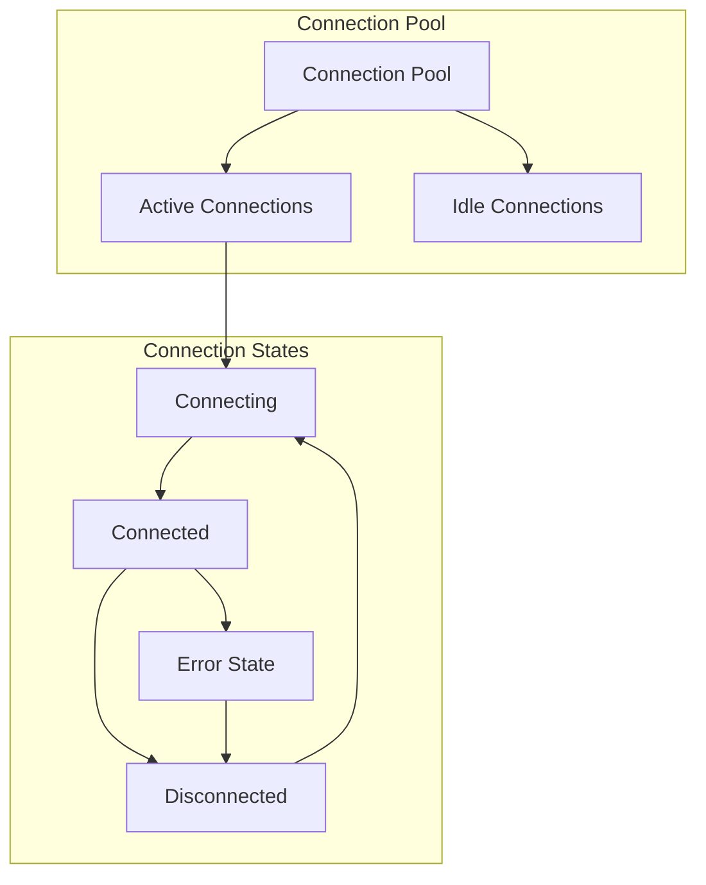

## Testing Architecture

### Test Structure

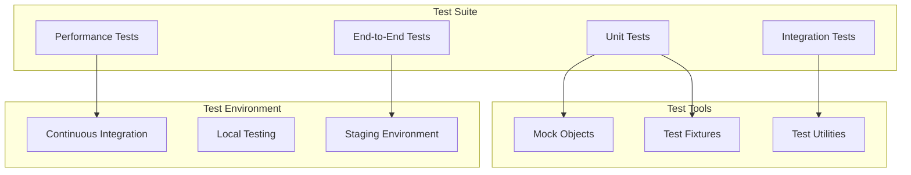

### Test Coverage

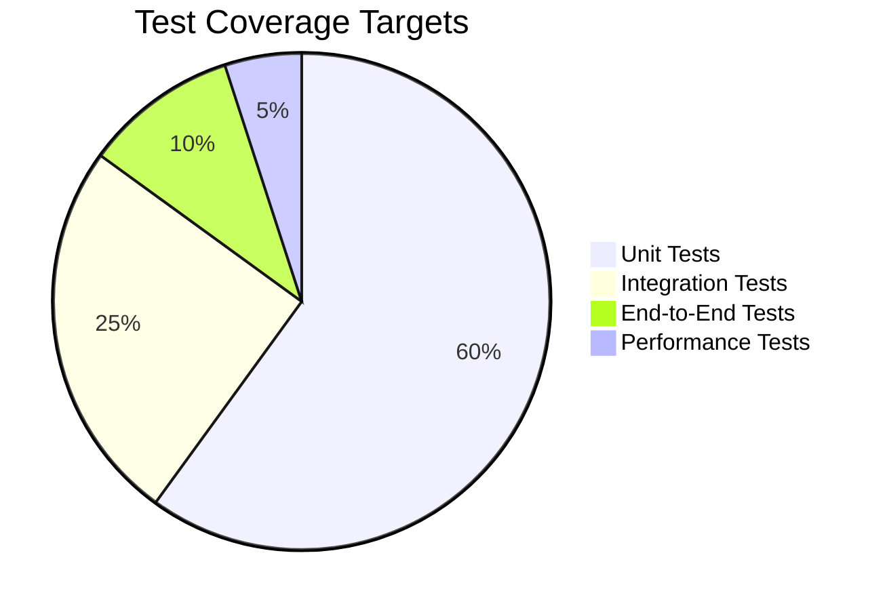

## Deployment Architecture

### Package Structure

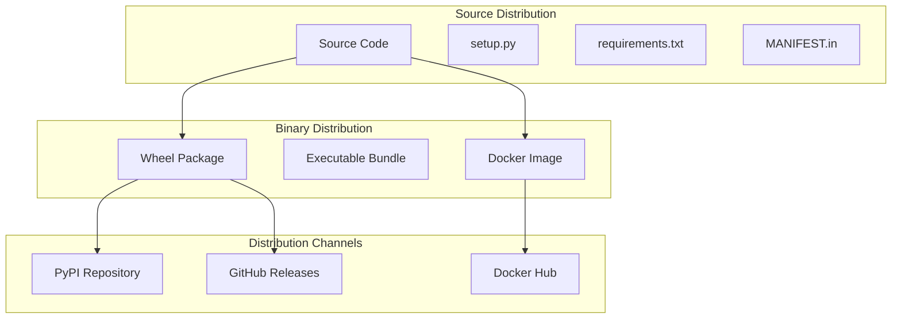

### CI/CD Pipeline

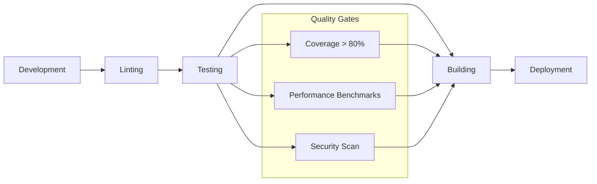

## Conclusion

This architecture provides a solid foundation for a scalable, maintainable, and performant BitChat client. The modular design allows for easy testing, extension, and modification while maintaining clear separation of concerns.

The key principles guiding this architecture are:

1. **Modularity**: Each component has a single responsibility
2. **Testability**: All components can be tested in isolation
3. **Performance**: Efficient resource management and async operations
4. **Security**: Robust cryptographic implementation
5. **Extensibility**: Plugin architecture for future features
6. **Maintainability**: Clear interfaces and documentation

This architecture will enable DeezChat to scale from a prototype to a production-ready application while maintaining the core principles of decentralization, privacy, and user control.