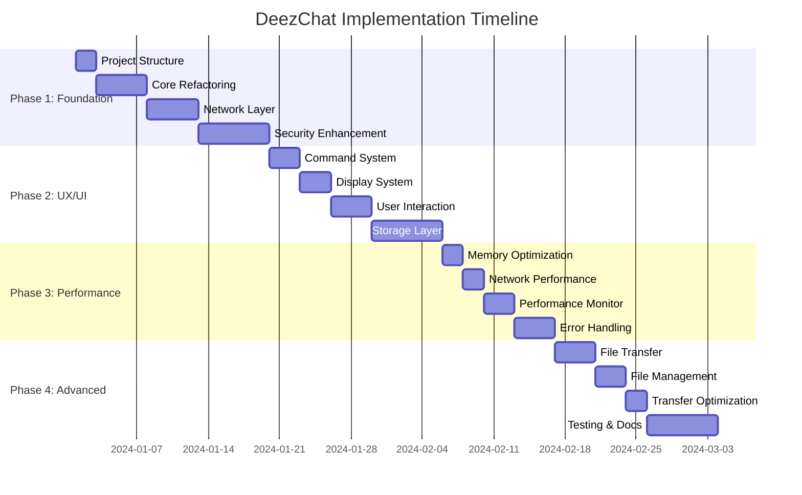

# DeezChat Implementation Roadmap

## Overview

This roadmap provides a detailed implementation plan for transforming DeezChat from its current prototype state into a production-ready, full-featured BitChat client. The roadmap is organized by phases with specific deliverables and success criteria.

## Phase 1: Foundation Refactoring (Weeks 1-2)

### Week 1: Core Modularization

#### Objectives
- Break down monolithic [`bitchat.py`](bitchat.py:1) into focused modules
- Establish proper project structure
- Implement basic configuration management

#### Tasks

**Day 1-2: Project Structure Setup**
- [ ] Create new modular directory structure
- [ ] Set up proper package initialization files
- [ ] Create base classes and interfaces
- [ ] Set up development environment and tooling

**Day 3-4: Core Client Refactoring**
- [ ] Extract main client logic to `core/client.py`
- [ ] Create message router in `core/message.py`
- [ ] Implement session manager in `core/session.py`
- [ ] Add proper error handling and logging

**Day 5-7: Network Layer Separation**
- [ ] Extract BLE logic to `network/ble.py`
- [ ] Create peer discovery in `network/discovery.py`
- [ ] Implement message transport in `network/transport.py`
- [ ] Add connection pooling and management

#### Deliverables
- Modular project structure
- Refactored core client
- Basic network layer
- Configuration management system

#### Success Criteria
- All modules have < 500 lines of code
- Clear separation of concerns
- No circular dependencies
- Basic functionality preserved

### Week 2: Security Layer Enhancement

#### Objectives
- Optimize Noise Protocol implementation
- Improve key management
- Add proper session handling

#### Tasks

**Day 8-9: Noise Protocol Optimization**
- [ ] Optimize handshake performance
- [ ] Add session caching
- [ ] Implement proper error recovery
- [ ] Add key rotation support

**Day 10-11: Key Management**
- [ ] Implement secure key storage
- [ ] Add key rotation mechanism
- [ ] Create key derivation utilities
- [ ] Add identity management

**Day 12-14: Session Management**
- [ ] Implement session pooling
- [ ] Add session lifecycle management
- [ ] Create session cleanup routines
- [ ] Add session monitoring

#### Deliverables
- Optimized security layer
- Robust key management
- Efficient session handling
- Security test suite

#### Success Criteria
- Handshake time < 2 seconds
- Session establishment success rate > 95%
- No memory leaks in security layer
- Comprehensive security tests

## Phase 2: User Interface and Experience (Weeks 3-4)

### Week 3: Terminal Interface Enhancement

#### Objectives
- Improve terminal user experience
- Add advanced command system
- Implement better message formatting

#### Tasks

**Day 15-16: Command System**
- [ ] Create extensible command framework
- [ ] Add command registration system
- [ ] Implement command completion
- [ ] Add command history and aliases

**Day 17-18: Display System**
- [ ] Create theme system for terminal
- [ ] Implement message formatting
- [ ] Add status indicators
- [ ] Create help system

**Day 19-21: User Interaction**
- [ ] Add tab completion for nicknames
- [ ] Implement interactive menus
- [ ] Add progress indicators
- [ ] Create tutorial system

#### Deliverables
- Enhanced terminal interface
- Comprehensive command system
- Theme support
- Interactive help system

#### Success Criteria
- Command discovery time < 1 second
- Intuitive command structure
- Responsive interface during operations
- Comprehensive help coverage

### Week 4: Storage and Configuration

#### Objectives
- Implement robust data persistence
- Create comprehensive configuration system
- Add data migration capabilities

#### Tasks

**Day 22-23: Database Layer**
- [ ] Implement SQLite database schema
- [ ] Create message storage and retrieval
- [ ] Add search functionality
- [ ] Implement data migration

**Day 24-25: Configuration Management**
- [ ] Create configuration schema
- [ ] Implement configuration file handling
- [ ] Add environment variable support
- [ ] Create configuration validation

**Day 26-28: Data Management**
- [ ] Add backup and restore
- [ ] Implement data cleanup
- [ ] Create export/import functionality
- [ ] Add data integrity checks

#### Deliverables
- Complete database layer
- Configuration management system
- Data backup/restore
- Migration tools

#### Success Criteria
- Database operations < 100ms
- Configuration changes applied immediately
- Data integrity verified
- Zero data loss during migrations

## Phase 3: Performance and Reliability (Weeks 5-6)

### Week 5: Performance Optimization

#### Objectives
- Optimize memory usage
- Improve network performance
- Add performance monitoring

#### Tasks

**Day 29-30: Memory Optimization**
- [ ] Implement memory pooling
- [ ] Add resource cleanup
- [ ] Optimize data structures
- [ ] Add memory monitoring

**Day 31-32: Network Performance**
- [ ] Optimize BLE communication
- [ ] Implement message prioritization
- [ ] Add connection optimization
- [ ] Create network metrics

**Day 33-35: Performance Monitoring**
- [ ] Implement metrics collection
- [ ] Add performance profiling
- [ ] Create performance dashboard
- [ ] Add benchmarking tools

#### Deliverables
- Optimized memory management
- High-performance networking
- Performance monitoring system
- Benchmarking tools

#### Success Criteria
- Memory usage < 100MB
- Message delivery < 500ms
- CPU usage < 5% (idle)
- Comprehensive metrics coverage

### Week 6: Error Handling and Reliability

#### Objectives
- Improve error handling
- Add recovery mechanisms
- Implement robust logging

#### Tasks

**Day 36-37: Error Handling**
- [ ] Create comprehensive error hierarchy
- [ ] Implement error recovery strategies
- [ ] Add error reporting system
- [ ] Create error context tracking

**Day 38-39: Reliability Features**
- [ ] Add automatic reconnection
- [ ] Implement graceful degradation
- [ ] Create health checks
- [ ] Add failover mechanisms

**Day 40-42: Logging and Monitoring**
- [ ] Implement structured logging
- [ ] Add log rotation and management
- [ ] Create debugging tools
- [ ] Add alerting system

#### Deliverables
- Robust error handling system
- Reliability features
- Comprehensive logging
- Monitoring and alerting

#### Success Criteria
- Error recovery success rate > 90%
- Zero silent failures
- Comprehensive error context
- Real-time monitoring

## Phase 4: Advanced Features (Weeks 7-8)

### Week 7: File Sharing

#### Objectives
- Implement file transfer capabilities
- Add file management features
- Create transfer optimization

#### Tasks

**Day 43-44: File Transfer Protocol**
- [ ] Design file transfer protocol
- [ ] Implement transfer initiation
- [ ] Add data chunking and reassembly
- [ ] Create transfer verification

**Day 45-46: File Management**
- [ ] Implement file storage
- [ ] Add file metadata handling
- [ ] Create file organization
- [ ] Add file preview generation

**Day 47-49: Transfer Optimization**
- [ ] Implement resume capability
- [ ] Add transfer compression
- [ ] Create concurrent transfers
- [ ] Add transfer progress tracking

#### Deliverables
- Complete file sharing system
- File management interface
- Transfer optimization
- Progress tracking

#### Success Criteria
- File transfer speed > 1MB/s
- Resume capability for interrupted transfers
- Support for files up to 100MB
- Transfer integrity verification

### Week 8: Testing and Documentation

#### Objectives
- Create comprehensive test suite
- Add performance benchmarks
- Complete documentation

#### Tasks

**Day 50-51: Test Suite**
- [ ] Create unit test framework
- [ ] Add integration tests
- [ ] Implement end-to-end tests
- [ ] Add performance tests

**Day 52-53: Documentation**
- [ ] Complete API documentation
- [ ] Create user guides
- [ ] Add developer documentation
- [ ] Create troubleshooting guides

**Day 54-56: Deployment**
- [ ] Create packaging setup
- [ ] Add CI/CD pipeline
- [ ] Create distribution packages
- [ ] Add deployment documentation

#### Deliverables
- Comprehensive test suite
- Complete documentation
- Deployment packages
- CI/CD pipeline

#### Success Criteria
- Test coverage > 80%
- Documentation completeness
- Automated deployment
- Cross-platform compatibility

## Implementation Details

### Development Workflow

#### Daily Workflow
1. **Morning Standup**: Review progress, identify blockers
2. **Development**: Implement assigned tasks
3. **Testing**: Write and run tests for new code
4. **Code Review**: Peer review of changes
5. **Integration**: Merge and test integration
6. **Documentation**: Update relevant documentation

#### Quality Gates
Each phase must pass quality gates before proceeding:

**Code Quality**
- [ ] All code passes linting
- [ ] Type hints for all functions
- [ ] Documentation for public APIs
- [ ] No security vulnerabilities

**Performance**
- [ ] Meets performance benchmarks
- [ ] No memory leaks
- [ ] Efficient resource usage
- [ ] Scalability verified

**Reliability**
- [ ] Error handling comprehensive
- [ ] Recovery mechanisms tested
- [ ] Logging functional
- [ ] Monitoring operational

### Risk Management

#### Technical Risks
1. **BLE Compatibility**: Platform-specific differences
   - **Mitigation**: Cross-platform testing
   - **Contingency**: Fallback implementations

2. **Performance Regression**: Optimization introduces bugs
   - **Mitigation**: Continuous benchmarking
   - **Contingency**: Performance monitoring

3. **Security Vulnerabilities**: New code introduces risks
   - **Mitigation**: Security reviews
   - **Contingency**: Rapid patching process

#### Schedule Risks
1. **Task Complexity**: Underestimated complexity
   - **Mitigation**: Buffer time in estimates
   - **Contingency**: Scope reduction

2. **Dependencies**: External library issues
   - **Mitigation**: Dependency monitoring
   - **Contingency**: Alternative implementations

### Success Metrics

#### Phase 1 Success Metrics
- [ ] Modularization completed
- [ ] Code coverage > 60%
- [ ] Performance benchmarks met
- [ ] Basic functionality preserved

#### Phase 2 Success Metrics
- [ ] User experience improved
- [ ] Command response time < 1s
- [ ] Configuration system operational
- [ ] Data integrity verified

#### Phase 3 Success Metrics
- [ ] Performance targets achieved
- [ ] Memory usage < 100MB
- [ ] Error recovery > 90%
- [ ] Monitoring operational

#### Phase 4 Success Metrics
- [ ] File sharing functional
- [ ] Test coverage > 80%
- [ ] Documentation complete
- [ ] Deployment automated

## Resource Allocation

### Team Structure
- **Lead Developer**: Architecture and core implementation
- **UI/UX Developer**: Interface and user experience
- **Security Engineer**: Cryptography and security review
- **QA Engineer**: Testing and quality assurance
- **DevOps Engineer**: Deployment and monitoring

### Tools and Infrastructure
- **Development**: VS Code, Git, Python 3.8+
- **Testing**: pytest, coverage, tox
- **CI/CD**: GitHub Actions, Docker
- **Monitoring**: Prometheus, Grafana
- **Documentation**: MkDocs, Sphinx

### Budget Considerations
- **Development Time**: 8 weeks full-time
- **Testing Infrastructure**: Cloud resources for CI/CD
- **Security Audit**: External security review
- **Documentation**: Technical writing resources

## Timeline Visualization

## Conclusion

This implementation roadmap provides a structured approach to transforming DeezChat into a production-ready application. The phased approach allows for:

1. **Incremental Progress**: Each phase builds upon previous work
2. **Risk Mitigation**: Early identification and resolution of issues
3. **Quality Assurance**: Continuous testing and review throughout
4. **Stakeholder Alignment**: Regular checkpoints and demonstrations

The successful completion of this roadmap will result in a robust, efficient, and user-friendly BitChat client that meets all requirements outlined in the PRD and maintains the core principles of decentralization, privacy, and open-source development.

Regular progress reviews and adaptation to changing requirements will ensure the final product meets user needs and technical standards.